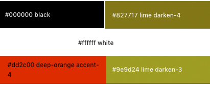

<h1 align="center">Acoustra Manager</h1>

<span id="acoustra"></span>


Welcome to Acoustra Manager where you get the opportunity to create your own profile directly on the band's website. You will have the means to create your own blog, edit, delete and update that blog. You will have access to available songs the band have along with merchandising as well. You can select a date you may be interested in coming to seee the band play or simply send in a request to see if they are available to come play in your neck of the woods.

Acoustra Manager is designed to be user friendly and easy access and navigate around the pages. It is customisable to suit the user's needs enabling them to have full control over any input they have. The Admin's page can be viewed but cannot be editied adn that also applies to each individual user, they can create their own page but cannot alter another members page or input.

This project is the third out of four Milestone Projects in the Full Stack Web Development Program I am attending at The Code Institute.

**[View the live project here.](https://ms3-breaktasty.herokuapp.com/)**

---

## Index 

- <a href="#ux">1. User experience (UX)</a>
  - <a href="#ux-goals">1.1. Project goals</a>
  - <a href="#ux-stories">1.2 User stories</a>
  - <a href="#ux-design">1.3 Design</a>
  - <a href="#ux-architecture">1.4 Information architecture</a>
  - <a href="#ux-mockup">1.5 Mockup designs</a>
- <a href="#features">2. Features</a>
  - <a href="#features-existing">2.1 Existing features</a>
  - <a href="#features-future">2.2 Features left to implement in the future</a>
- <a href="#technologies">3. Technologies used</a>
- <a href="#testing">4. Testing</a>
- <a href="#deployment">5. Deployment</a>
- <a href="#credits">6. Credits</a>
- <a href="#Acknowledge">7. Acknowledge</a>
- <a href="#Acknowledge">8. Disclaimer</a>

---

<span id="ux"></span>

<h1>1. User experience (UX)</h1>

<span id="ux-goals"></span>

### 1.1 Project goals 

- Making a full-stack site that allows users to manage a common dataset about a particular domain. 
- Making a full-stack site that uses HTML, CSS, JavaScript, Python+Flask and MongoDB.

- Creating a website that serves as a platform where people can access band information and get involved in a more personal manner. They can create stories of their own experience with the band and check for live performances.

- Creating a website that is simple to understand and easy to navigate.
- The users of the website can make use of CRUD (create, read, update and delete) for the information they wish to include. 

<span id="ux-stories"></span>

### 1.2 User stories 

**First-time visitor goals:**
1. As a first time visitor, I want to be able to visit the website on every device, so that I can look at the website on desktop, mobile and tablet. 
2. As a first time visitor, I want to be able to navigate easily through the website, so I can find everything with minimul effort. 
3. As a first time visitor, I want to see an overview of all users, so I can get inspired by other people's stories or queries.
4. As a first time visitor, I want to be able to search for options by categories, so I can easily find what I'm looking for. 
5. As a first time visitor, I want to be able to search the site based on key words, so I can find information easily. (For example, I can search the word dates or  all recipes with the ingredient Banana or banana in the recipe name will appear.)
6. As a first time visitor, I want to register an account on the website, so I can share my experiences with other users
7. As a first time visitor, I want to sign up for the newsletter. 

**Site member goals:** 

All the goals of first-time visitors also apply for site members. There are additional user stories to the site members because they have more access to the website. See the additional user stories below. 
1. As a site member, I want to add my blogs, so I can share my stories. 
2. As a site member, I want to edit my blogs, so I can update information in them.
3. As a site member, I want to delete my blogs, so I can remove them if no longer relevant. 
4. As a site member, I want to login to my profile, so I have access to my information. 
5. As a site member, I want to logout to my profile, so I can logout from my profile. 


**Admin goals:**

All the goals of the first time visitors and site members also apply for the admin. The admin has additional user stories to manage the categories of the site. 
1. As an admin, I want to add new categories, so I can make the categories clear and manageable. 
2. As an admin, I want to edit categories, so I can update categories. 
3. As an admin, I want to delete categories, so I can remove categories when they are no longer relevant. 

<span id="ux-design"></span>

### 1.3 Design 

- #### Colour scheme 
The six colours that are used for the Acoustra Manager website are very similar to the original website design for the band. I have chosen these colours to remain close to the original color scheme the banfd already use. 



- **The black colour** is used for the background across all pages, this is to co-ordinate with the main colour the band use.
- **The white colour** is used on all input pages for clear and easy to see input received from the user.The white has a striking  contrast to the black colour. 
- **The lime colour** is the navbar and accordion dropdown selections. This colour again makes the comntrast with the black stand out more. 
- **The second lime colour** is used for the edit and delete buttons to distinquish against the existing background colours.
- **The deep orange accent colour**  is used to show important buttons.

- #### Fonts
The **Bebas Neue font** and **Raleway font** are used throughout the whole website. Sans serif and cursive are the fallbacks in case the main font isn’t being imported to the site correctly. The Bebas Neue font is used for all titles, the instruction text, the recipes names, ingredients and other special text that should stand out more. This font is used because the font is all in capital letters and has a sleek appearance. The Raleway font is used for all paragraph text. This font is used because it is easy to read and matches well with the Bebas Neue font. 

- #### Icons
In the project, icons are used that are provided by [Font Awesome](https://fontawesome.com/). The Icons that are used have functional purposes such as the dropdown menu and social media icons. 

- #### Images
The images I used for this project came from [Acoustra](https://www.acoustraweddingband.com/). Images are used for the logo and picture on the home page. 

- #### Defensive design 

    - The user is not able to break the site by clicking on buttons. 
    - The signup form: 
        - The username has to be between 5-20 characters and only must contain letters and numbers. 
        - The password has to be between 5-20 characters and must contain at least one number, and one uppercase and lowercase letter.
    - The add and edit forms:
     - The forms can be filled out to be between 1-5000 characters to allow the user to input their blog.
        - The category has to be chosen.
        - The image URL must start with http:// or https://.
        - The number of serves and prepping time has to be numbered.
    - By the email subscriber, the email must be in the following order: characters followed by a @ symbol, followed by more characters and then a “.”.
    - A recipe or category can't be deleted by just one click. If someone clicks on the delete button, there wil be a pop up with a confirmation if someone is sure to delete the recipe or category.

- #### Interactive design 

    - The website has to be easy to navigate. 
    - The user can quickly find the information he/she wants to find. 


<span id="ux-architecture"></span>

### 1.4 Information architecture
The project has four collections in the database. The database structure in MongoDB is as follows: 


<span id="ux-mockup"></span>

### 1.5 Mockup designs
Mockup designs are made with [Balsamiq Wireframes](https://balsamiq.com/wireframes/)

Click on the links below to see the wireframes in Balsamiq.
  
|[Acoustra Manager](static/images/acoustramanagerwireframes)| 

<span id="features"></span>

<h1>2. Features</h1>

<span id="features-existing"></span>

### 2.1 Existing features 

#### 1. Design 
- An attractive and simple layout with consistency.
- Simple navigation throughout the website by using the navigation bar. 
- Showing the recipes .simple and clearly

#### 2. General 
- The index page shows an introduction in the shape of a header and introduction text. And the page shows a couple of new recipes. 
- There are links to the social media platforms at the top and bottom of the website. 
- People can sign up for the newsletter. 

#### 3. Recipes
- Recipes can be created, read, updated and deleted (CRUD) by the users. 
- Recipes can be sorted by category.
- People can search for recipes with the search bar. 
- Users have access to their profile, with an overview of all their recipes. 
- Recipes include ingredients, instructions, tips, prepping time and serves.

#### 4. Signup, login and logout 
- People can create a new account on the web application. 
- People can login with their existing accounts. 
- People can easily log out.
- If a person creates a new account, logs in or logs out, a flashed message will appear with the action the person has done. 

<span id="features-future"></span>

### 2.2 Features left to implement in the future 
- Changing the number of ingredients based on the number of people.
- Adding a favorite section. Users can favorite a recipe and see them on their favorite page. 
- On the overview of recipes multiple pages with all recipes, instead of a long list of all recipes. 
- For an image of the recipe, users have to fill in the image URL. For the future, there also can be an option to upload the image. 
- Add form validation on the backend.
- The user can delete their profile.

<span id="technologies"></span>

<h1>3. Technologies used</h1>

#### Languages used
- [HTML5](https://en.wikipedia.org/wiki/HTML5)
    - HTML5 provides the structure and the content for my project. 
- [CSS3](https://en.wikipedia.org/wiki/Cascading_Style_Sheets)
    - CSS3 provides the style of the HTML5 elements.
- [jQuery](https://jquery.com/)
    - jQuery used as the JavaScript functionality.
- [Python](https://www.python.org/)
    - Python provides the backend of the project.

#### Frameworks, libraries & Other
- [Gitpod](https://www.gitpod.io/) 
    - The GitPod is used to develop the project.
- [Git](https://git-scm.com/)
    - The Git was used for version control to commit to Git and push to GitHub.
- [GitHub](https://github.com/)
    - The GitHub is used to host the project.
- [Google Fonts](https://fonts.google.com/)
    - Google Fonts is used to provide the font roboto for all the text that is used in the project. 
- [Figma](https://www.figma.com/)
    - Figma is used to create the mockup designs for the project.
- [Materialize](https://materializecss.com/)
    - Materialize is used for the design framework.
- [MobgoDB](https://www.mongodb.com/1)
    - MongoDB is the fully managed cloud database service used for the project.
- [Heroku](https://dashboard.heroku.com/)
    - Heroki is the cloud platform to deploying the app.
- [Flask](https://flask.palletsprojects.com/en/1.1.x/)
    - Flask is the web framework used to provide libraries, tools and technologies for the app.
- [Jinja](https://jinja.palletsprojects.com/en/2.11.x/)
    - Jinja is used for templating Python
- [Werkzeug](https://werkzeug.palletsprojects.com/en/1.0.x/)
    - Werkzeug is used for password hashing and authentication and autohorization.

#### Testing tools used 
- [Chrome DevTools](https://developers.google.com/web/tools/chrome-devtools/open) is used to detect problems and test responsiveness.
- [Autoprefixer](https://autoprefixer.github.io/)
    - Autoprefixer is used to parse the CSS and to add vendor prefixes to CSS rules. 
- [W3C Markup Validation Service](https://validator.w3.org/)
    - The W3C Markup Validation Service is used to check whether there were any errors in the HTML5 code. 
- [W3C CSS validator](https://jigsaw.w3.org/css-validator/)
    - The W3C CSS validator is used to check whether there were any errors in the CSS3 code.
- [JShint](https://jshint.com/)
    - JShint is a JavaScript validator that is used to check whether there were any errors in the JavaScript code. 
- [PEP8](http://pep8online.com/)
    - The PEP8 validator is used to check whether there were any errors in the Python code.

<span id="testing"></span>

<h1>4. Testing</h1>

The testing process can be found [here](TESTING.md).

<span id="deployment"></span>

<h1>5. Deployment</h1>

#### Requirements 
- Python3 
- Github account 
- MongoDB account 
- Heroku account

#### Clone the project 
To make a local clone, follow the following steps. 
1. Log in to GitHub and go to the repository. 
2. Click on the green button with the text **“Code”.**
3. Click on **“Open with GitHub Desktop”** and follow the prompts in the GitHub Desktop Application or follow the instructions from **[this link](https://docs.github.com/en/free-pro-team@latest/github/creating-cloning-and-archiving-repositories/cloning-a-repository#cloning-a-repository-to-github-desktop)** to see how to clone the repository in other ways. 

#### Working with the local copy
1. Install all the requirements: Go to the workspace of your local copy. In the terminal window of your IDE type: **pip3 install -r requirements.txt**.
2. Create a database in MongoDB  
    - Signup or login to your MongoDB account.
    - Create a cluster and a database.
    - Create four collections in the db: **categories, recipes, subscribers, users.**
    - Add string values for the collections. See <a href="#ux-architecture">my Information architecture</a> how the database is set up for this project.
3. Create the environment variables 
    - Create a .gitignore file in the root directory of the project.
    - Add the env.py file in the .gitignore.
    - Create the file env.py. This  will contain all the envornment variables.
    ```
    Import os
    os.environ.setdefault("IP", "Added by developer")
    os.environ.setdefault("PORT", "Added by developer")
    os.environ.setdefault("SECRET_KEY", "Added by developer")
    os.environ.setdefault("MONGO_URI", "Added by developer")
    os.environ.setdefault("MONGO_DBNAME", "Added by developer")
    ```
4. Run the app: Open your terminal window in your IDE. Type python3 app.py and run the app.

#### Heroku Deployment  
1. Set up local workspace for Heroku 
    - In terminal window of your IDE type: **pip3 freeze -- local > requirements.txt.** (The file is needed for Heroku to know which filed to install.)
    - In termial window of your IDE type: **python app.py > Procfile** (The file is needed for Heroku to know which file is needed as entry point.)
2. Set up Heroku: create a Heroku account and create a new app and select your region. 
3. Deployment method 'Github'
    - Click on the **Connect to GitHub** section in the deploy tab in Heroku. 
        - Search your repository to connect with it.
        - When your repository appears click on **connect** to connect your repository with the Heroku. 
    - Go to the settings app in Heroku and go to **Config Vars**. Click on **Reveal Config Vars**.
        - Enter the variables contained in your env.py file. it is about: **IP, PORT, SECRET_KEY, MONGO_URI, MONGO_DBNAME**
4. Push the requirements.txt and Procfile to repository. 
     ```
    $ git add requirements.txt
    $ git commit -m "Add requirements.txt"

    $ git add Procfile 
    $ git commit -m "Add Procfile"
    ```
5. Automatic deployment: Go to the deploy tab in Heroku and scroll down to **Aotmatic deployments**. Click on **Enable Automatic Deploys**. By **Manual deploy** click on **Deploy Branch**.

Heroku will receive the code from Github and host the app using the required packages. 
Click on **Open app** in the right corner of your Heroku account. The app wil open and the live link is available from the address bar. 


<span id="credits"></span>

<h1>6. Credits</h1>

#### Recipes
- Green smoothie - [Goodfood](https://www.bbcgoodfood.com/recipes/kale-smoothie) by Sophie Godwin. 
- Avocado smoothie - [Chocolate Covered Katie](https://chocolatecoveredkatie.com/avocado-smoothie-recipe/)
- Healthy oatmeal - [Fit foodie](https://fitfoodiefinds.com/the-50-best-oatmeal-recipes-on-the-planet/) by Lee Funke
- Egg Benedict - [Eat Smarter!](https://eatsmarter.com/recipes/salmon-and-spinach-eggs-benedict-with-butter-sauce)
- Banana oatmeal - [Everyday Delicious](https://www.everyday-delicious.com/banana-peanut-butter-and-pomegranate-oatmeal/) by Aleksandra 
- Classic waffles - [All recipes](https://www.allrecipes.com/recipe/20513/classic-waffles/) by Megan
- Banana pancakes - [Minimalist Baker](https://minimalistbaker.com/5-ingredient-banana-egg-pancakes/)
- Fluffy pancakes - [Chocolate Sandchai](https://www.chocolatesandchai.com/fluffy-fluffy-pancakes/) by Riz
- Sunny eggs - [Jamie Oliver](https://www.jamieoliver.com/recipes/eggs-recipes/sunny-side-up-eggs/)


#### Media 
- Header image - [Elle Hughes](https://www.pexels.com/nl-nl/@elletakesphotos).
- Green smoothie - Pexels by [Alisha Mishra](https://www.pexels.com/nl-nl/@alisha-mishra-579430).
- Avocado smoothie - Pexels by  [Emilia Czarnota](https://www.pexels.com/nl-nl/@emilia-czarnota-3807932)
- Healthy oatmeal - Pexels by  [Keegan Evans](https://www.pexels.com/nl-nl/@keegan-evans-10986)
- Egg Benedict - Pexels by [Brett Jordan](https://www.pexels.com/nl-nl/@brettjordan)
- Banana oatmeal - Pexels by [Hanna Brannigan](https://www.pexels.com/nl-nl/@hana-brannigan-2014526)
- Classic waffles - Pexels by [Jill Wellington](https://www.pexels.com/nl-nl/@jill-wellington-1638660) 
- Banana pancakes - Pexels by [Hanna Brannigan](https://www.pexels.com/nl-nl/@hana-brannigan-2014526)
- Fluffy pancakes - Pexels by [Elif Tekkaya](https://www.pexels.com/nl-nl/@eliftekkaya) 
- Sunny eggs - Pexels by [Daniele Constantini](https://www.pexels.com/nl-nl/@daniela-constantini)

#### Code
- [Flask error handling - Python on the web - Learning Flask ep. 18](https://www.youtube.com/watch?v=mBKKZN1MMBM)
- [W3Schools: HTML Input Pattern Attribute](https://www.w3schools.com/tags/att_input_pattern.asp)
- [W3Schools: HTML Input Attributes](https://www.w3schools.com/html/html_form_attributes.asp)

<span id="Acknowledge"></span>

<h1>7. Acknowledge</h1>

Thanks to the following people and organizations who helped or inspired me for the project:  
- The support and guidance of my mentor Precious Ijege. 
- The lessons and knowledge of [Code Institute.](https://codeinstitute.net/)
- The advice about a bug of Igor and Cormac from the Tutor Assistance 

<span id="Disclaimer"></span>

<h1>8. Disclaimer</h1>
This project is for educational purposes only. If there is an issue with the copyright or the content, please contact me: juan.stelling@gmail.com

Thanks for visiting

<a href="#breaktasty">Back to top!</a>
